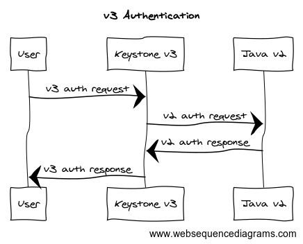

# Keystone-RXT Authentication Plugin

This repo is a simple authentication plugin for Rackspace Global Auth that will allow an OpenStack environment to use
Rackspace Global Auth as an IDP.

When the plugin is installed the `password` authentication method is required, and the plugin value needs to be be set
to `rxt`. Once activated, the plugin will run normally allowing both local users and remote users to authenticate to
the cloud. The RXT authentication plugin presents a federated token and conforms to the mapping authentication driver.

### Why?

The answer is quite simple, Rackspace Public Cloud Identity provides a powerful set of tools which can allow folks
to make use of their existing users within an OpenStack environment; additionally, this setup allows us to use
OpenStack natively.

### How?

To bridge the authentication gap between Keystone and Rackspace Identity the keystone-rxt authentication driver
effectively acts as a [reverse proxy](https://en.wikipedia.org/wiki/Reverse_proxy) to Rackspace Identity and
then presents the returned data as a federated token.



#### History

This plugin was inspired by the [Capstone](https://github.com/rackerlabs/capstone) project. Process wise, Capstone
and Keystone-RXT perform similar actions using Rackspace Identity as an IDP compatible with OpenStack. While
Keystone-RXT was inspired by Capstone, the two projects serve different purposes.

### Mapping

Within this repository is an example mapping file `mapping.json` which will create different users based on the roles
a user has within Rackspace Identity. This file is just an example and can be customized to meet the demands of the
OpenStack environment following the typical mapping setup. See more about Keystone Mapping and Federation
[here](https://docs.openstack.org/keystone/latest/admin/federation/mapping_combinations.html).

----

## Deploying the `keystone-rxt` plugin.

Before we can do anything you need to install the plugin within your keystone environment, for development purposes
the example here is using `pip`.

``` shell
pip install --force --upgrade git+https://github.com/cloudnull/keystone-rxt
```

> This plugin is not yet on PyPi, but that will change with time.

### Setup your environment

Once the authentication plugin is installed, update your `keystone.conf` to use the new password plugin named `rxt`.

The configuration file entry will look something like this

``` conf
[auth]
methods = password,token,application_credential
password = rxt
```
> Take note that the `password` method is defined and that the password plugin is set to use `rxt`.

If you have multifactor auth enabled, and want to support users that are running work loads with it
the plugin also supports TOTP. To enable TOPT make sure `totp` is in your allowed authentication
methods and that the `totp` plugin is using the `rxt` plugin.

``` conf
[auth]
methods = password,token,application_credential,totp
password = rxt
totp = rxt
```

Yes, effectively one line is all that's required in config (maybe two with totp support). After the
configuration edit, be sure to restart keystone.

### Identity mapping, project, and domain setup

Once the plugin is setup and running, everything will be operating normally. The plugin is passive until
the Keystone is informed about the identity provider and we have the `rackspace_cloud_domain` created.

##### Craete the domain

``` shell
openstack domain create rackspace_cloud_domain
```

##### Create the identity provider

``` shell
openstack identity provider create --remote-id rackspace --domain rackspace_cloud_domain rackspace
```

##### Create the mapping for our identity provider

``` shell
openstack mapping create --rules files/mapping.json rackspace_mapping
```

##### Create the federation protocol

``` shell
openstack federation protocol create rackspace --mapping rackspace_mapping --identity-provider rackspace
```

## Using The RXT Authentication Plugin

Using the plugin is no different that a typical day in the cloud. Simply authenticate using your favorite method,
just make sure you include the `rackspace_cloud_domain` domain.

##### Authentication using `openstacksdk`

This setup requires a federated token to work. The clouds yaml will not pull a token by default.

``` yaml
clouds:
  local:
    auth:
      auth_url: http://localhost:5000/v3
      project_name: 67890_Development
      project_domain_name: rackspace_cloud_domain
      username: test
      password: secrete
      user_domain_name: rackspace_cloud_domain
    region_name: RegionOne
    interface: internal
    identity_api_version: "3"
```

If you're running the CLI tools with a TOTP enabled user and you don't want to use your API key,
setup your `clouds.yaml` with the following options so that it knows to run with `password` and
`totp`.

``` yaml
clouds:
  rxt-local-mfa:
    auth_type: "v3multifactor"
    auth_methods:
      - v3password
      - v3totp
    auth:
      auth_url: http://localhost:5000/v3
      project_name: 67890_Development
      project_domain_name: rackspace_cloud_domain
      username: test
      password: secrete
      user_domain_name: rackspace_cloud_domain
    region_name: RegionOne
    interface: internal
    identity_api_version: "3"
```

> Enabling TOTP will require you to use your one time token to run commands, this token can be
  defined on the CLI with the `--os-passcode` flag; for example the simple image list would look
  like so `openstack --os-cloud local --os-passcode 123456 image list`

Once you have the clouds CLI setup, run commands normally.

```shell
openstack --os-cloud local image list
+--------------------------------------+-------------------------------------------------+--------+
| ID                                   | Name                                            | Status |
+--------------------------------------+-------------------------------------------------+--------+
| 6af793ec-d5d2-4a70-a284-cbbb223365f3 | debian-10-openstack-amd64.qcow2                 | active |
| 4ee2c1b4-1055-40b8-ad6b-eb3c9eb7b4d7 | debian-11-genericcloud-amd64.qcow2              | active |
| f16a1332-a5fb-46d5-b2ae-caa136cf9432 | jammy-server-cloudimg-amd64-disk-kvm.img        | active |
| 9e2c968c-c5b3-4a1b-9355-261fa9907e16 | ubuntu-bionic-server-cloudimg-amd64.img         | active |
| 0ee7d71b-2043-49a0-b107-56ebbbcd6b95 | ubuntu-focal-server-cloudimg-amd64-disk-kvm.img | active |
| 804cc228-251c-4081-97df-f609c0e568e7 | ubuntu-jammy-server-cloudimg-amd64-disk-kvm.img | active |
| da9923a8-ac4b-4036-ac14-46264247eb27 | ubuntu-xenial-server-cloudimg-amd64-disk1.img   | active |
+--------------------------------------+-------------------------------------------------+--------+
```

##### Authentication using `cURL`

You can also use `cURL` to great effect.

> Example POST json files can be found in the files directory.

``` shell
curl -sS -D - -H "Content-Type: application/json" --data-binary "@get-scoped-token" "http://172.16.27.211:5000/v3/auth/tokens" -o /dev/null
HTTP/1.1 201 CREATED
Content-Type: application/json
Content-Length: 5594
X-Subject-Token: OS_TOKEN
Vary: X-Auth-Token
x-openstack-request-id: req-5a0eb098-eecc-41e1-a10d-d872dc867561
Connection: close
```

With the about command we can pull out the value of `X-Subject-Token` and store it as `OS_TOKEN` so that we can
authenticate to the various APIs supported by our service catalog.

``` shell
curl -H "Accept: application/json" -H "X-Auth-Token: $OS_TOKEN" http://localhost:9292/v2/images
```
