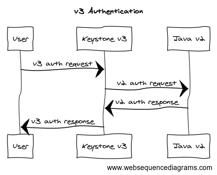

# Keystone-RXT Authentication Plugin

This repo is a simple authentication plugin for Rackspace Global Auth that will allow an OpenStack environment to use
Rackspace Global Auth as an IDP.

When the plugin is installed the `password` authentication method is required, and the plugin value needs to be be set
to `rxt`. Once activated, the plugin will run normally allowing both local users and remote users to authenticate to
the cloud. The RXT authentication plugin presents a federated token and conforms to the mapping authentication driver.

### Why?

The answer is quite simple, Rackspace Public Cloud Identity provides a powerful set of tools which can allow folks
to make use of their existing users within an OpenStack environment; additionally, this setup allows us to use
OpenStack natively.

### How?

To bridge the authentication gap between Keystone and Rackspace Identity the keystone-rxt authentication driver
effectively acts as a [reverse proxy](https://en.wikipedia.org/wiki/Reverse_proxy) to Rackspace Identity and
then presents the returned data as a federated token.



#### History

This plugin was inspired by the [Capstone](https://github.com/rackerlabs/capstone) project. Process wise, Capstone
and Keystone-RXT perform similar actions using Rackspace Identity as an IDP compatible with OpenStack. While
Keystone-RXT was inspired by Capstone, the two projects serve different purposes.

### Mapping

Within this repository is an example mapping file `mapping.json` which will create different users based on the roles
a user has within Rackspace Identity. This file is just an example and can be customized to meet the demands of the
OpenStack environment following the typical mapping setup. See more about Keystone Mapping and Federation
[here](https://docs.openstack.org/keystone/latest/admin/federation/mapping_combinations.html).

### Keystone compatibility

The plugin overrides Keystone's federation mapping project handler
(`keystone.auth.plugins.mapped.handle_projects_from_mapping`). Keystone 2026.1
changed that handler's positional contract. RXT supports two known API
generations:

- Keystone 2024.1, 2025.1, and 2025.2 use
  `handle_projects_from_mapping(shadow_projects, idp_domain_id,
  existing_roles, user, assignment_api, resource_api)`.
- Keystone 2026.1 uses
  `handle_projects_from_mapping(shadow_projects, existing_roles, user,
  schema_version, assignment_api, resource_api)`.

At import time, RXT requires the installed handler's complete signature to
match one of these contracts. A missing or unrecognized handler raises
`RuntimeError` while the plugin is loading, rather than allowing arguments to
bind incorrectly during a federated login. This protects against unsupported
changes to the private Keystone API without relying on package-version strings
or runtime argument types.

### Role reconciliation

**Rackspace Identity is authoritative for the direct project-role grants of an
authenticating RXT user.** On each successful login the override creates or
updates the mapped projects, grants the mapped roles, and revokes the user's
direct project-role grants that Rackspace Identity no longer supplies,
including grants on projects that are no longer returned. Group, domain, and
inherited assignments are never modified, and no other user's assignments are
touched. Because these grants carry no provenance in Keystone, a direct project
grant added manually for a mapped user is also revoked unless Rackspace
Identity supplies it.

Revocation requires a complete identity provider response. If the role or
tenant lookup fails, returns partial data, or is served from a cache entry
written before this behavior existed, the login still proceeds but no grants
are revoked. Each revocation and each skipped reconciliation is logged at
`INFO` with the user, project, and role.

Completeness is why the tenant lookup requests `apply_rcn_roles=true` and
follows the collection's pagination links. The effective-roles endpoint always
reports RCN-sourced tenant assignments, so without that parameter the two
views disagree and RCN-reachable Flex tenants look as though they were
removed. A tenant collection that cannot be read in full — an unrecognized
response shape, a failed page, or one that exceeds the supported page count —
is reported as no result at all, which preserves existing grants.

Reconciliation happens only during a successful RXT login. Application
credentials, EC2/S3 credentials, trusts, and users who never authenticate
again do not trigger it, so removing access for those cases still requires an
out-of-band process that revokes grants and, where appropriate, disables the
mapped user or deletes the stored credentials.

RXT customizes Keystone's schema 1.0 and 2.0 processor registrations without
removing newer registrations supplied by Keystone. The 2026.1 adapter accepts
`schema_version` for API compatibility; RXT applies its own reconciliation
rather than Keystone's schema 3.0 stale-assignment handling, and preserving a
schema 3.0 registration does not add RXT's project metadata extensions to that
schema.

### Running the tests

The verification tests in `tests/` import the installed Keystone driver and
exercise the selected project-projection adapter through the corresponding
upstream call contract. To verify every compatibility path, run the suite in
separate environments containing Keystone 2024.1, Keystone 2025.1,
Keystone 2025.2, and Keystone 2026.1:

``` shell
python3 -m venv .venv
.venv/bin/pip install pytest==8.3.5 \
    --editable <path-to-keystone> \
    --editable .
.venv/bin/python -m pytest tests/ -v
```

----

## Deploying the `keystone-rxt` plugin.

Before we can do anything you need to install the plugin within your keystone environment, for development purposes
the example here is using `pip`.

``` shell
pip install --force --upgrade git+https://github.com/rackerlabs/keystone-rxt
```

> This plugin is not yet on PyPi, but that will change with time.

### Setup your environment

Once the authentication plugin is installed, update your `keystone.conf` to use the new password plugin named `rxt`.

The configuration file entry will look something like this

``` conf
[auth]
methods = password,token,application_credential
password = rxt
```

> Take note that the `password` method is defined and that the password plugin is set to use `rxt`.

If you have multifactor auth enabled, and want to support users that are running work loads with it
the plugin also supports TOTP. To enable TOPT make sure `totp` is in your allowed authentication
methods and that the `totp` plugin is using the `rxt` plugin.

``` conf
[auth]
methods = password,token,application_credential,totp
password = rxt
totp = rxt
```

If you are using the `saml2` federation protocol, you will also need to add the `saml2` plugin to your
`keystone.conf` file.

``` conf
[auth]
methods = password,token,application_credential,saml2
password = rxt
totp = rxt
saml2 = rxt
```

Yes, just a couple of lines is all that's required in config. After the configuration edit, be sure to restart
keystone.

#### Rackspace Configurations

The `[rackspace]` section can also be used in your `keystone.conf` to allow you to configure how to anchor on
roles.

| key               | value |
| ----------------- | ----- |
| `role_attribute` | A string option used as an anchor to discover roles attributed to a given user |
| `role_attribute_enforcement` | When set `true` will limit a users project to only the discovered GUID for the defined `role_attribute` |

#### User enablement authority

Rackspace Identity is authoritative for users authenticated through RXT. After a successful fresh password, API key,
TOTP, or SAML authentication and identity mapping, the plugin re-enables the mapped Keystone user when necessary.
Disabling an RXT-managed user only in Keystone is therefore not a durable lockout; disable the user at Rackspace
Identity, or disable the relevant Keystone identity provider or domain, to prevent future access. Incomplete MFA
challenges, cached service-catalog reuse, and existing-token rescoping do not re-enable users.

### Identity mapping, project, and domain setup

Once the plugin is setup and running, everything will be operating normally. The plugin is passive until
the Keystone is informed about the identity provider and we have the `rackspace_cloud_domain` created.

#### Mapping Setup

Available environment variables.

| Environment Variable | Explanation |
| ----------------- | ----- |
| `RXT_UserName` | Username to be mapped |
| `RXT_Email` | Email address from the user name |
| `RXT_DomainID` | Domain ID for the federated assignment |
| `RXT_TenantName` | Semicolon separated list of tenants mapped to the user |
| `RXT_TenantID` | Tenant ID for the project |
| `RXT_orgPersonType` | RBAC association |

#### SAML Mapping Setup

Available environment variables.

| Environment Variable | Explanation |
| ----------------- | ----- |
| `REMOTE_ACCOUNT_NAME` | Account Name |
| `REMOTE_AUTH_TOKEN` | Account Auth Token |
| `REMOTE_AUTH_URL` | Auth URL |
| `REMOTE_DDI` | Account DDI |
| `REMOTE_DOMAIN` | Account Domain |
| `REMOTE_SCOPED_TOKEN` | Scoped Auth Token |
| `REMOTE_SESSION_CREATION` | Session creation time |
| `REMOTE_EMAIL` | Remote user Email Address |
| `uid` | Remote user ID |
| `REMOTE_USERNAME` | Remote Username |

##### Create the domain

``` shell
openstack domain create rackspace_cloud_domain
```

#### Create the identity provider

``` shell
openstack identity provider create --remote-id rackspace --domain rackspace_cloud_domain rackspace
```

##### Create the mapping for our identity provider

``` shell
openstack mapping create --rules files/mapping.json --schema-version 2.0 rackspace_mapping
```

##### Create the federation protocol

``` shell
openstack federation protocol create rackspace --mapping rackspace_mapping --identity-provider rackspace
```

## Using The RXT Authentication Plugin

Using the plugin is no different that a typical day in the cloud. Simply authenticate using your favorite method,
just make sure you include the `rackspace_cloud_domain` domain.

### Authentication using `openstacksdk`

This setup requires a federated token to work. The clouds yaml will not pull a token by default.

``` yaml
clouds:
  local:
    auth:
      auth_url: http://localhost:5000/v3
      project_name: 67890_Development
      project_domain_name: rackspace_cloud_domain
      username: test
      password: secrete
      user_domain_name: rackspace_cloud_domain
    region_name: RegionOne
    interface: internal
    identity_api_version: "3"
```

If you're running the CLI tools with a TOTP enabled user and you don't want to use your API key,
setup your `clouds.yaml` with the following options so that it knows to run with `password` and
`totp`.

``` yaml
clouds:
  rxt-local-mfa:
    auth_type: "v3multifactor"
    auth_methods:
      - v3password
      - v3totp
    auth:
      auth_url: http://localhost:5000/v3
      project_name: 67890_Development
      project_domain_name: rackspace_cloud_domain
      username: test
      password: secrete
      user_domain_name: rackspace_cloud_domain
    region_name: RegionOne
    interface: internal
    identity_api_version: "3"
```

> Enabling TOTP will require you to use your one time token to run commands, this token can be
  defined on the CLI with the `--os-passcode` flag; for example the simple image list would look
  like so `openstack --os-cloud local --os-passcode 123456 image list`

Once you have the clouds CLI setup, run commands normally.

```shell
openstack --os-cloud local image list
+--------------------------------------+-------------------------------------------------+--------+
| ID                                   | Name                                            | Status |
+--------------------------------------+-------------------------------------------------+--------+
| 6af793ec-d5d2-4a70-a284-cbbb223365f3 | debian-10-openstack-amd64.qcow2                 | active |
| 4ee2c1b4-1055-40b8-ad6b-eb3c9eb7b4d7 | debian-11-genericcloud-amd64.qcow2              | active |
| f16a1332-a5fb-46d5-b2ae-caa136cf9432 | jammy-server-cloudimg-amd64-disk-kvm.img        | active |
| 9e2c968c-c5b3-4a1b-9355-261fa9907e16 | ubuntu-bionic-server-cloudimg-amd64.img         | active |
| 0ee7d71b-2043-49a0-b107-56ebbbcd6b95 | ubuntu-focal-server-cloudimg-amd64-disk-kvm.img | active |
| 804cc228-251c-4081-97df-f609c0e568e7 | ubuntu-jammy-server-cloudimg-amd64-disk-kvm.img | active |
| da9923a8-ac4b-4036-ac14-46264247eb27 | ubuntu-xenial-server-cloudimg-amd64-disk1.img   | active |
+--------------------------------------+-------------------------------------------------+--------+
```

##### Authentication using `cURL`

You can also use `cURL` to great effect.

> Example POST json files can be found in the files directory.

``` shell
curl -sS -D - -H "Content-Type: application/json" --data-binary "@get-scoped-token" "http://172.16.27.211:5000/v3/auth/tokens" -o /dev/null
HTTP/1.1 201 CREATED
Content-Type: application/json
Content-Length: 5594
X-Subject-Token: OS_TOKEN
Vary: X-Auth-Token
x-openstack-request-id: req-5a0eb098-eecc-41e1-a10d-d872dc867561
Connection: close
```

With the about command we can pull out the value of `X-Subject-Token` and store it as `OS_TOKEN` so that we can
authenticate to the various APIs supported by our service catalog.

``` shell
curl -H "Accept: application/json" -H "X-Auth-Token: $OS_TOKEN" http://localhost:9292/v2/images
```

#### Create the SAML identity provider

``` shell
openstack --os-cloud default identity provider create \
          --remote-id "https://login.rackspace.com" \
          --domain rackspace_cloud_domain \
          Rackspace-Federation
```

> The `keystone-rxt` plugin will use the provider name `Rackspace-Federation` to identify the SAML identity provider.

##### Create the SAML mapping for our identity provider

``` shell
openstack --os-cloud default mapping create \
          --rules files/rackspace-saml-mapping.json \
          --schema-version 2.0 \
          saml_mapping
```

##### Create the SAML federation protocol

``` shell
openstack --os-cloud default federation protocol create saml2 \
          --mapping saml_mapping \
          --identity-provider Rackspace-Federation
```

Once the SAML identity provider is ready, and deployed; you can use the SAML authentication via WebSSO.

To use the openstack API, it is required to first create an application credential for the user within the UI. This will
allow the user to authenticate using the SAML identity provider and then use the application credential to
authenticate to the OpenStack API.

### Authentication using `openstacksdk` and Application Credentials

This setup requires a federated token to work. The clouds yaml will not pull a token by default.

``` yaml
  rxt-application-credential:
    auth_type: v3applicationcredential
    auth:
      auth_url: http://localhost:5000/v3
      application_credential_id: ${APP_CRED_ID}
      application_credential_secret: ${APP_CRED_SECRET}
    region_name: RegionOne
    interface: internal
    identity_api_version: "3"
```
